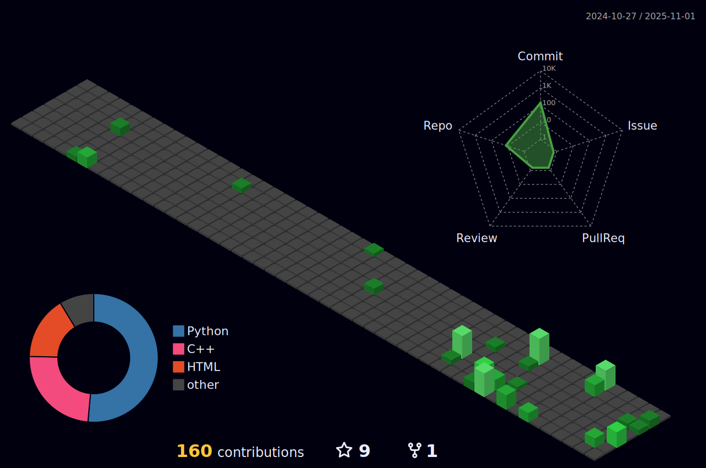

# 👋 Hi, I'm Artin Khodayari

  

💻 Passionate programmer, OS developer, and lover of freedom.  
🚀 Always exploring new things to learn and have fun.  
✨ Turning ideas that seem hard to believe into reality: "I can do it."

---

---

## 🔥 Current Projects  
- 🤖 **Jarvis**
  - A [**personal-digital assistant**](https://github.com/Artin-khodayari/Jarvis) in Python (speech recognition, TTS, AI integration).  
- 🖥️ **Damavand OS**
  - My own [**operating system**](https://github.com/Artin-khodayari/DAMAVAND-OS) built with **Assembly & C++** (no GRUB, no shortcuts).  
- 🐍 **Damavand-lang**
  - A programming language written in Python, designed to be simple yet powerful.  
- 🎮 **Terminal Apps**
  - Python-based code editor named [**DemEdit**](https://github.com/Artin-khodayari/DamEdit-CLI)

---

## ⚡ Skills & Tools  

  <!-- Programming Languages -->
  
  
  
  
  
  
   
  <!-- Tools -->
  
  
  
  
  
  
   
  <!-- Frameworks & Libraries -->
  
  
  

---

## 📊 GitHub Stats  

---

## 📫 Connect with Me
- [**GitHub**](https://github.com/Artin-khodayari)  
- [**Linkedin**](https://www.linkedin.com/in/artin-khodayari/)
- [**Gmail**](Artinkhodayari2010@gmail.com)

---

⭐ *"Persistence beats difficulty. Every bug fixed brings me closer to building something real."*
